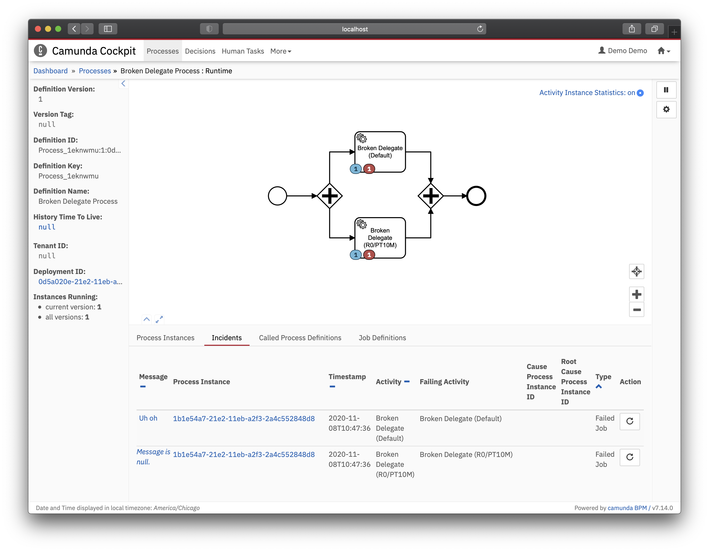

Simple example of two different incident messages. To get started, run `mvn spring-boot:run` and launch
 `Broken Delegate Process` from the Tasklist. You should end up with something like this in Cockpit:
 
 